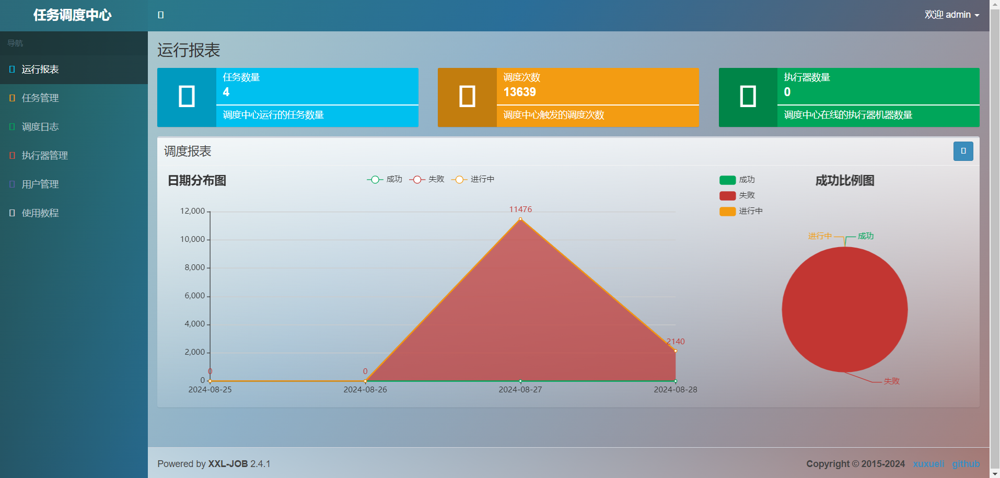
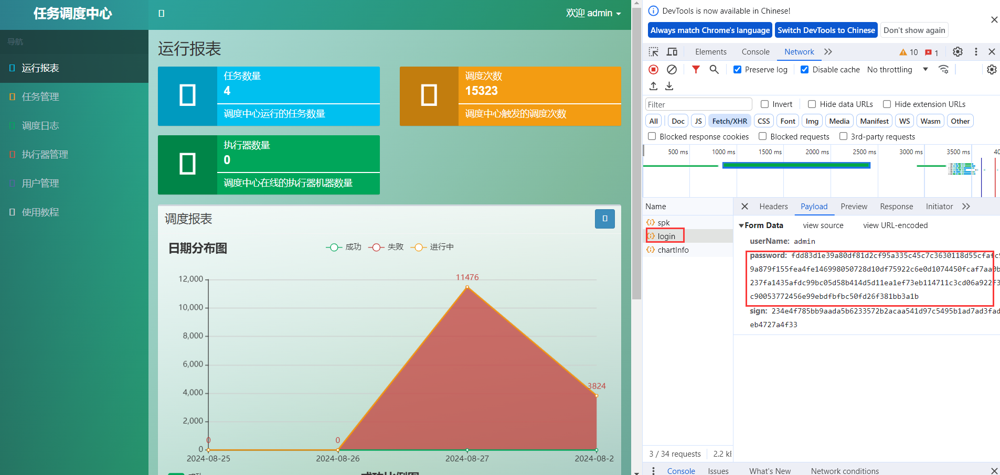
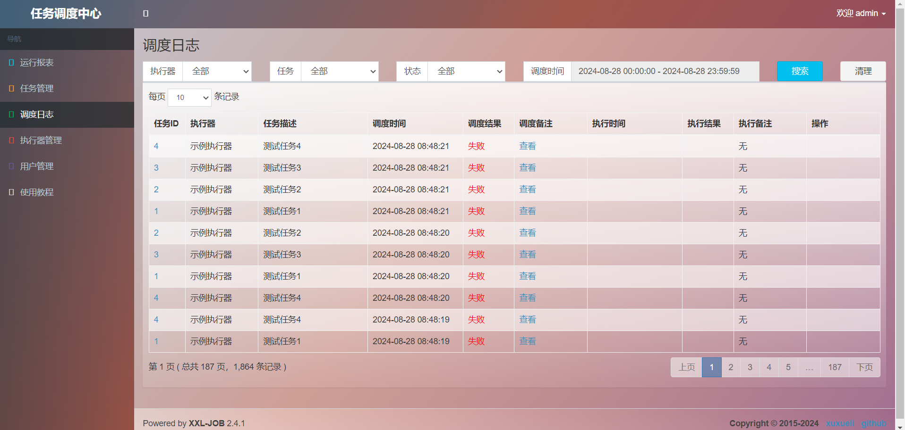
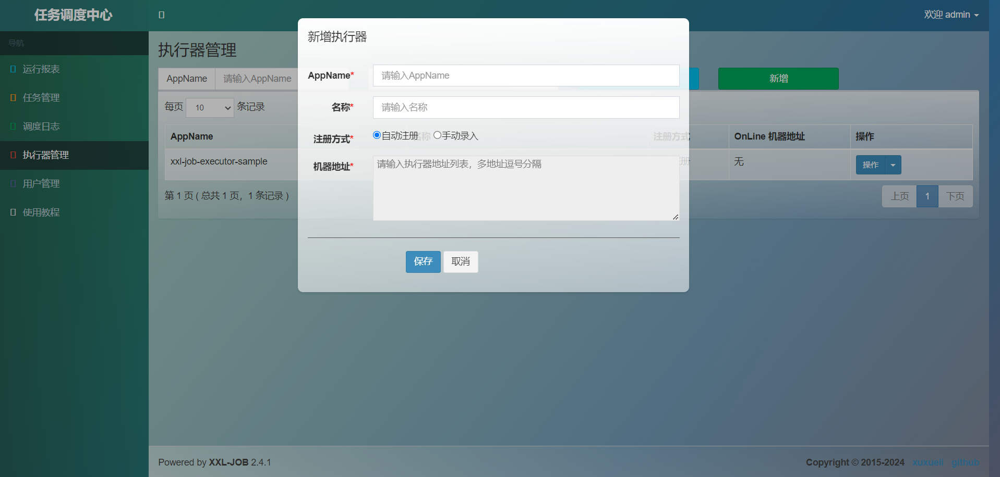
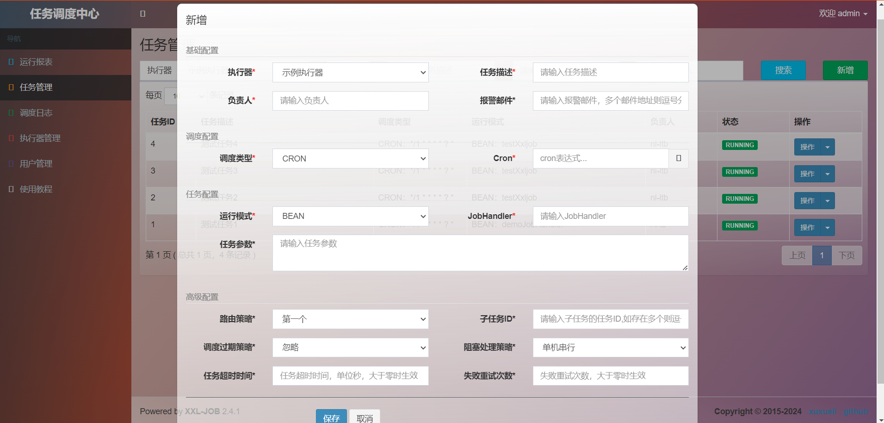

# multiply platform database supports

## project
- this project is a branch from https://github.com/xuxueli/xxl-job .
- and this project was forked
- it changes include in pull request https://github.com/xuxueli/xxl-job/pull/3899
```shell
feat(多数据库): 支持多数据库类型、国密加密传输、Bcrypt慢速散列盐存储密码、批量操作
```
- aim to adapt oracle/gbase xxl-job-admin.
- those change not effect xxl-job-core,.
- below config database platform to switch target platform
```shell
# database platform, mysql|oracle|postgre|gbase|h2|dm|kingbase|sqlserver
xxl.job.platform.type=mysql
```
- actually, mysql grammar adapted to gbase, or other, so that, other database could be use mysql platform.

- 这个项目是 https://github.com/xuxueli/xxl-job 的一个分支。
- 这是一个fork出来的项目
- 它的变更都包含在PR中 https://github.com/xuxueli/xxl-job/pull/3462
```shell
feat(database): support multiply database type & secure enhance #3462
```
- 目标是适配 oracle/gbase 版本的 xxl-job-admin
- 这些改变不影响 xxl-job-core
- 下面的配置数据库平台为目标平台
```shell
# database platform, mysql|oracle|postgre|gbase|h2|dm|kingbase|sqlserver
xxl.job.platform.type=mysql
```
- 实际上，mysql 的语法适用于 gbase ，或者其他兼容的数据库，所以其他数据库也可以使用 mysql 平台

## Repository
- fork github: https://github.com/Ice2Faith/xxl-job.git

- mirror gitee: https://gitee.com/ice2faith/xxl-job.git 
- release package maybe storage on mirror repository

- fork 仓库 github: https://github.com/Ice2Faith/xxl-job.git

- 镜像仓库 gitee: https://gitee.com/ice2faith/xxl-job.git
- 发行版二进制包可能会发布在镜像仓库中

## notice
- 2026-01-06
    - 同步最新的3.4.0-SNAPSHOT版本，跟随官方依赖 springboot4,jdk17
- 2026-01-06
    - 同步最新的3.3.2版本，跟随官方依赖 springboot4,jdk17
- 2026-01-06
    - 同步最新的3.3.1版本，此版本开始跟随官方依赖到springboot4,jdk17
    - 因为官方依赖SSO部分抽离为单独的依赖，适配难度较高，且不适合后续版本适配
    - 因此，从此版本开始，不在区分springboot版本，仅维护一个对应官方的分支
    - 新分支管理策略：v[官方版本]/multiply/master
- 2025-01-11
    - 同步最新的3.0.0-SNAPSHOT版本，为最后一个同步官方的springboot2版本
    - 官方在此之后升级为springboot3+jdk17
    - 后续将会在springboot3分支中保持与官方版本同步，同时将会协同地将官方修改也同步到springboot2(master)版本中
    - 不过分支命名可能会变更：master->springboot2, springboot3->master

## Branch Merge Rule
- [master] fork from official master and adapt multiply database
- [springboot3] adapt to springboot3 & jakarta & jdk17 base on master
- [multiply/master] partial upgrade package for [master]
- [multiply/springboot3] partial upgrade package for [springboot3]
- merge rule : source merge to target [source] -> [target]
- all rule is :
- [master] -> [springboot3]
- [master] -> [multiply/master]
- [springboot3] -> [multiply/springboot3]

- [master] 从官方fork其master分支进行多数据库适配
- [springboot3] 基于master分支适配 springboot3 & jakarta & jdk17
- [multiply/master] 是 [master]分支的分包打包适配
- [multiply/springboot3] 是 [springboot3]分支的分包打包适配
- merge 规则 : 源分支合并到目标分支 [source] -> [target]
- 所有规则如下 :
- [master] -> [springboot3]
- [master] -> [multiply/master]
- [springboot3] -> [multiply/springboot3]

## features
- support database type list
    - mysql(official)
    - oracle
    - postgre
    - gbase(南大通用)
    - h2
    - dm(dameng/达梦)
    - kingbase(人大金仓)
    - sqlserver(>=2012)
- support auto run init sql
    - finish
- secure protect
    - password payload transfer encrypt by sm2
    - cookie token encrypt by sm2
    - sm2 support by com.antherd/sm-crypto-0.3.0
    - because of it support java and js environment
    - password database store encode by BCryptPasswordEncoder instead of MD5
        - this change was not adapt official
        - will cause that already exists user cannot login
        - so that, suggest new project to use it
        - but you can direct modify database table to cover password
        - sql is : update table xxl_job_user set password='$2a$10$rElzP.wCmjyjsVIIqoP4fe8u1qH3otIxiG4UhYs9A3Ivsrm1LrpOu' where 1=1;
        - this update will set all user password to : 123456
        - and next, to change password in web page
- api invoke
    - support use api invoke admin by http header name "token"
    - got token value by /login response header "token"
    - response such as:
    - token: expire1716627232689.073d3d163...
    - it split by '.' as two part
    - first part is expire1716627232689 mean this token will expire at 1716627232689 milliseconds timestamp
    - second part is token body
    - and then, request with this header to invoke api
    - request token is "expire1716627232689.073d3d163..." or "073d3d163...", all right
    - how to login ?
        - like this:
        - static/js/login.1.js
        - to search "submitHandler" or "generateKeyPairHex"

- 支持的数据库库类型
    - mysql(官方)
    - oracle
    - postgre
    - gbase（南大通用）
    - h2
    - dm（达梦数据库）
    - kingbase（人大金仓）
    - sqlserver(>=2012)
- 支持自动运行初始化脚本
    - 已完成
- 安全保护
    - 密码的报文传输使用SM2加密
    - Cookie的token使用SM2加密
    - SM2 由com.antherd/sm-crypto-0.3.0提供
    - 因为他支持java和js环境
    - 数据库保存的密码使用BCryptPasswordEncoder代替MD5
        - 这个改变不兼容官方
        - 将导致已经存在的用户无法登录
        - 所以，建议新项目使用
        - 但是，你也可以直接修改数据库表覆盖密码
        - SQL是：update table xxl_job_user set password='$2a$10$rElzP.wCmjyjsVIIqoP4fe8u1qH3otIxiG4UhYs9A3Ivsrm1LrpOu' where 1=1;
        - 这个更新将会设置所有用户的密码为：123456
        - 然后，去网页中更新密码
- api 调用
    - 支持调用admin的接口，通过在http请求头中添加 "token"
    - token 在 /login 接口响应头 "token" 中
    - 响应头类似：
    - token: expire1716627232689.073d3d163...
    - 它被 '.' 分为两部分
    - 第一部分是 expire1716627232689 表示这个 token 将会在 1716627232689 毫秒时间戳过期
    - 第二部分是 token 体
    - 接下来，请求时携带这个请求头调用
    - 请求的 token 是 "expire1716627232689.073d3d163..." 或者 "073d3d163..." 都对
    - 怎么登录呢？
        - 像这样：
        - static/js/login.1.js
        - 搜索 "submitHandler" 或者 "generateKeyPairHex"

## usage
- 1. download the package
    - xxl-job-admin-all.tar.gz
```shell
wget https://gitee.com/ice2faith/xxl-job/releases/download/v3.3.1/xxl-job-admin-all.tar.gz
```
```
- 2. release it
```shell
tar -xzvf xxl-job-admin-all.tar.gz
```
- 3. cd to package
```shell
cd xxl-job-admin
```
- 4. modify the config file
```shell
vi resources/application-dev.properties
```
- 5. run it
```shell
./jarctrl.sh restart
```
- or direct run jar
```shell
java -jar xxl-job-admin.jar
```
- 6. view log
```shell
./jarctrl.sh log
```

## previews

- login page
- 登录页


- index page
- 首页



- encrypt transport
- 加密传输



- log page enhance
- 日志页增强



- executor page
- 执行器页面



- task page
- 任务页面


